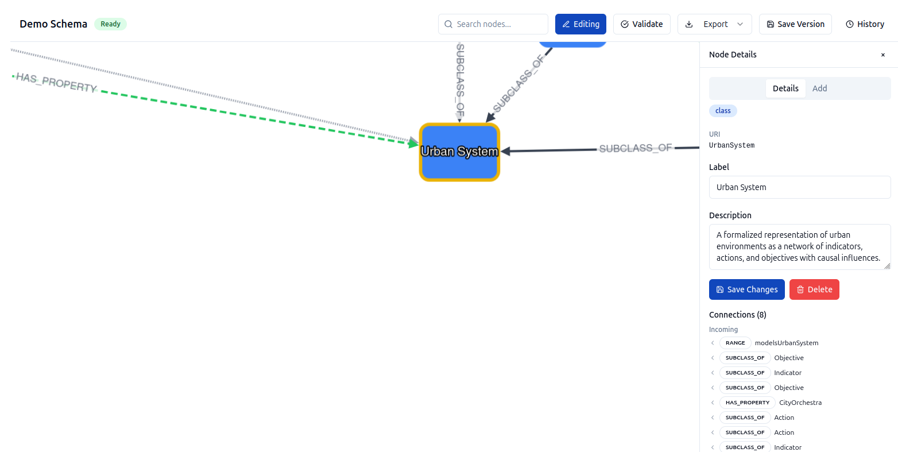
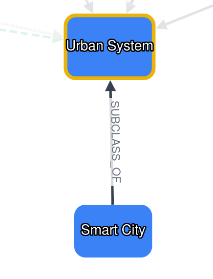
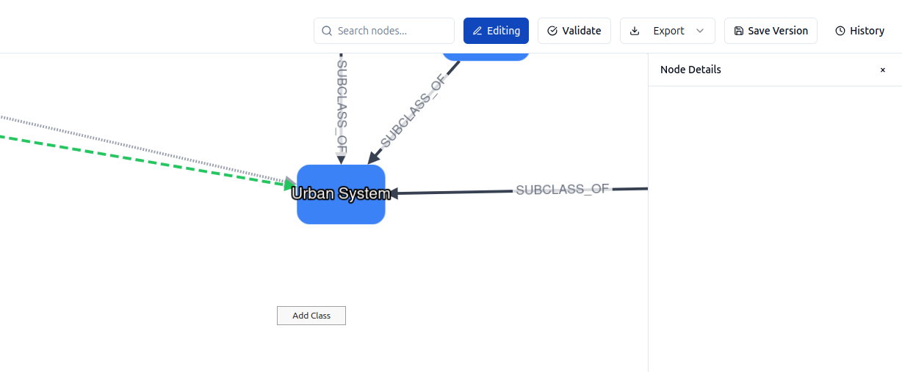
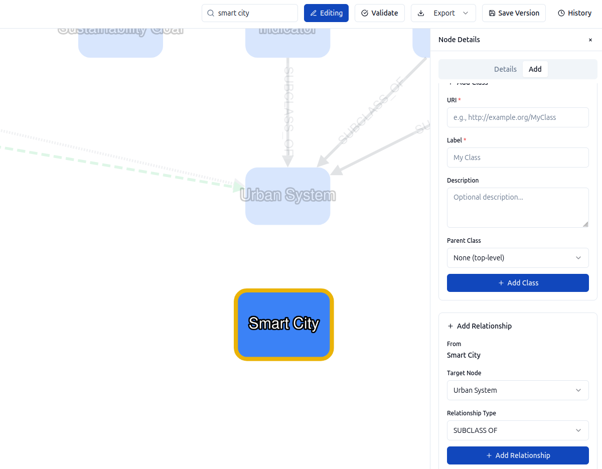
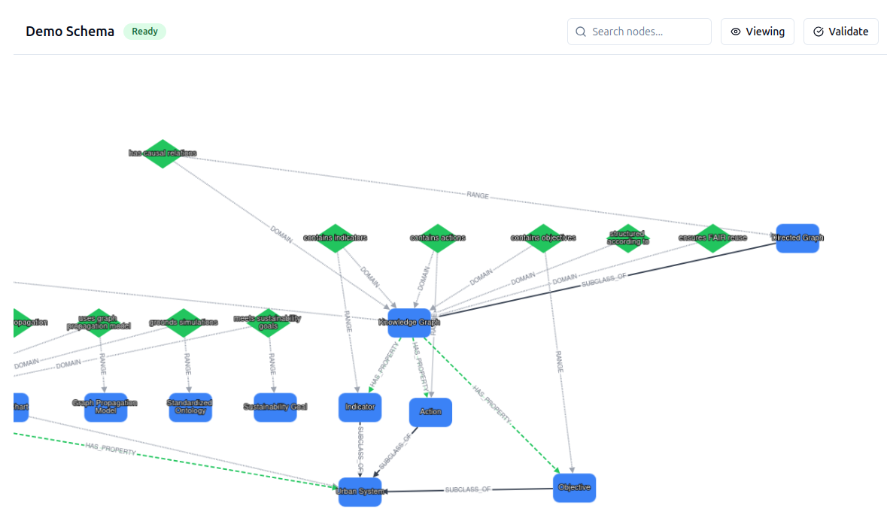
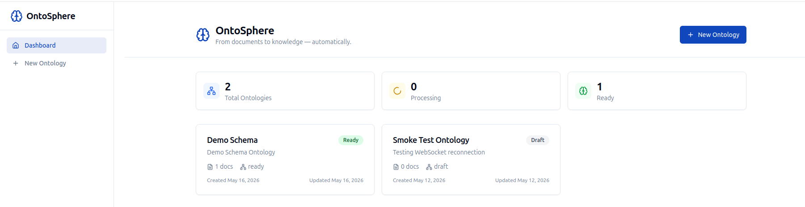
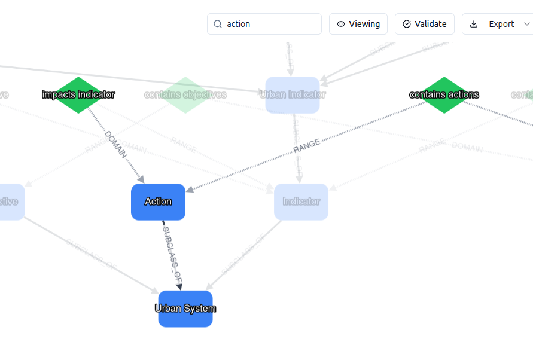
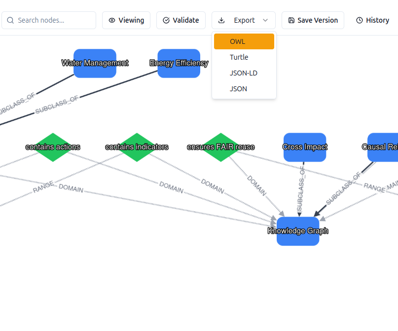
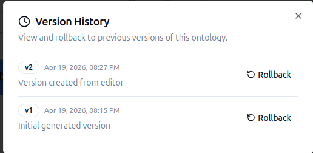

# OntoSphere

**Turn documents into navigable knowledge graphs.**

OntoSphere is an open-source tool that extracts structured ontologies from unstructured documents using LLMs. Upload a PDF, and it identifies classes, properties, and relationships -- then assembles them into an OWL/RDF knowledge graph you can explore, visually edit, and export. Built for anyone working with agentic systems, semantic layers, GraphRAG pipelines, or domain-specific ontologies.



---

## What's New in v0.2.0

- **Visual graph editing** -- drag-to-connect edges between classes, right-click context menus on nodes and canvas
- **Edit mode toggle** -- switch between Viewing and Editing modes from the toolbar
- **Add classes and relationships visually** -- no scripts, no config files
- **Robust WebSocket reconnection** -- exponential backoff with dormant mode and manual retry button
- **Connection status banner** -- non-intrusive indicator when live updates are unavailable

## Features

### Document-to-Ontology Pipeline

Upload a PDF and let LLMs (Azure OpenAI, OpenAI, or Anthropic) extract entities, properties, and relationships with full provenance tracking. Processing runs asynchronously via Celery workers with real-time progress updates over WebSocket.

### Visual Graph Editing

Toggle edit mode to modify your ontology directly on the graph canvas. Right-click nodes to edit, delete, or start a new relationship. Right-click empty space to add a new class. Drag between nodes to connect them.

<p align="center">
  
  
</p>

<p align="center">
  
  
</p>

### Ontology Browser

Browse and manage your ontologies from the dashboard. Each ontology tracks its processing status, document count, and version history.



### Search and Inspect

Search for classes by name and inspect node properties, relationships, and provenance in the side panel.



### Multi-Format Export

Export to JSON, Turtle (TTL), JSON-LD, and RDF/XML for use in downstream tools and triple stores.



### Versioning

Every generation and edit creates a version snapshot. Compare versions and roll back when needed.



### SHACL Validation

Validate generated ontologies against SHACL shape constraints. Violations are surfaced directly in the editor.

---

## Quick Start

### Prerequisites

| Dependency     | Version | Notes                              |
|----------------|---------|------------------------------------|
| Docker         | 20.10+  | Required                           |
| Docker Compose | 2.0+    | Required                           |
| LLM API key   | --      | Azure OpenAI, OpenAI, or Anthropic |

### Setup

```bash
# Clone the repository
git clone https://github.com/boricles/ontosphere.git
cd ontosphere

# Create your environment file
cp .env.example .env

# Edit .env and set your LLM API key:
#   ONTOSPHERE_LLM_API_KEY=your-actual-key
#   ONTOSPHERE_LLM_API_BASE=https://YOUR-RESOURCE.openai.azure.com

# Start all services
docker compose up --build -d

# Open the application
#   Frontend:  http://localhost:5173
#   API docs:  http://localhost:8000/docs
```

Database tables are created automatically on first startup.

```bash
docker compose down        # stop, keep data
docker compose down -v     # stop, wipe data
```

---

## Tech Stack

| Layer      | Technology                                                |
|------------|-----------------------------------------------------------|
| Frontend   | React 18, TypeScript, Vite, Cytoscape.js, Tailwind CSS   |
| Backend    | Python 3.11, FastAPI, SQLAlchemy 2.0 (async), Pydantic v2|
| Database   | PostgreSQL 16 + Apache AGE (graph queries)                |
| Queue      | Redis + Celery                                            |
| LLM        | Azure OpenAI / OpenAI / Anthropic (pluggable)             |
| Export     | RDFLib (Turtle, JSON-LD, RDF/XML)                         |
| Validation | pyshacl (SHACL shapes)                                    |

## Architecture

```
                   +---------------------+
                   |     Frontend         |
                   |  React + Vite        |
                   |  Port 5173           |
                   +----------+----------+
                              |
                              | REST / WebSocket
                              v
                   +----------+----------+
                   |     Backend          |
                   |  FastAPI + Uvicorn   |
                   |  Port 8000           |
                   +---+------------+----+
                       |            |
              +--------+--+    +----+--------+
              | PostgreSQL |    |    Redis    |
              | + Apache   |    | (broker +   |
              |   AGE      |    |  pub/sub)   |
              | Port 5432  |    | Port 6379   |
              +------------+    +------+------+
                                       |
                                +------+------+
                                |   Celery    |
                                |   Worker    |
                                +-------------+
```

---

## Configuration

All configuration is via environment variables. Copy `.env.example` to `.env` and adjust.

| Variable                       | Default       | Description                            |
|--------------------------------|---------------|----------------------------------------|
| `ONTOSPHERE_LLM_PROVIDER`     | `azure`       | `openai`, `azure`, or `anthropic`      |
| `ONTOSPHERE_LLM_API_BASE`     | --            | Base URL for the LLM API               |
| `ONTOSPHERE_LLM_API_KEY`      | --            | API key for the LLM provider           |
| `ONTOSPHERE_LLM_MODEL`        | `gpt-4o`      | Model / deployment name                |
| `DATABASE_URL`                 | (see .env)    | Async SQLAlchemy connection string     |
| `REDIS_URL`                    | `redis://redis:6379/0` | Redis for Celery and pub/sub  |
| `CORS_ORIGINS`                 | `localhost:*` | Allowed CORS origins                   |

See `.env.example` for the full list.

## API Documentation

Interactive API docs are available when the backend is running:

- **Swagger UI**: [http://localhost:8000/docs](http://localhost:8000/docs)
- **ReDoc**: [http://localhost:8000/redoc](http://localhost:8000/redoc)

---

## Development Setup (Without Docker)

### Backend

```bash
cd backend
python -m venv .venv
source .venv/bin/activate
pip install -e ".[dev]"
uvicorn app.main:app --reload --host 0.0.0.0 --port 8000
```

Requires a local PostgreSQL with Apache AGE extension and Redis.

### Frontend

```bash
cd frontend
npm install
npm run dev
```

### Tests

```bash
cd backend && pytest -v
```

---

## Roadmap

- [x] Document upload and text extraction (PDF)
- [x] LLM-based entity/property extraction with provenance
- [x] Automatic ontology assembly
- [x] Apache AGE graph storage
- [x] Interactive graph visualization (Cytoscape.js)
- [x] Multi-format export (JSON, Turtle, JSON-LD, RDF/XML)
- [x] SHACL validation
- [x] Ontology versioning
- [x] Real-time progress via WebSocket
- [x] Docker Compose orchestration
- [x] Robust WebSocket reconnect with dormant mode
- [x] Visual graph editing (drag-to-connect, context menus)
- [ ] Auto-generate class URIs from labels
- [ ] Relationship type picker in drag-to-connect flow
- [ ] Undo/redo for graph editing operations
- [ ] SHACL violation visualization in graph editor
- [ ] Authentication and authorization (OAuth 2.0 / OIDC)
- [ ] Multi-user / multi-tenant support

## Contributing

Contributions are welcome. Please:

1. Fork the repository
2. Create a feature branch: `git checkout -b feature/my-feature`
3. Make your changes and add tests
4. Ensure tests pass: `cd backend && pytest -v`
5. Open a Pull Request against `main`

## License

This project is licensed under the **Apache License 2.0**. See [LICENSE](LICENSE) for the full text.

---

Built by [Boris Villazon-Terrazas, PhD](https://www.linkedin.com/in/boris-villazon-terrazas-phd/) ([@boricles](https://github.com/boricles)).
